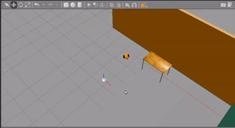

# Udacity Robotic Software NanoDegree
## GoChase it Project

### Introduction
The main objective of this project is to design and build a mobile robot model and place it in the world created in _Gazebo_. Then, program the robot to chase white-colored balls using _ROS C++ nodes_.

### Motivation
To consolidate the concepts learned in the Udacity Robotics Nanodegree and get hands-on experience of working with _C++, ROS, Gazebo enviroment_.

### Structure

There are two main packages within this repository

#### 1.my_robot
         my_robot package contains a mobile robot URDF file, Gazebo world, and the white ball files. 
#### 2.ball_chaser
        ball_chaser package contains two main ROS nodes. first one, the process_image node is responsible for identifying the white ball-
      position in a given image. and then drive_bot node will drive the robot to follow the white ball based on the information coming from 
      the process_image node. 
      
### Prerequisites 

#### 1.Install Gazebo and ROS in Linux.

#### 2. Cmake and gcc/g++

### Build

#### 1.Clone and Intialize the catkin workspace.
    
    
       $ mkdir -p catkin_ws
       $ cd catkin_ws/
       $ git clone https://github.com/RamCharanThota/Udacity_Robotic_ND_Proj2_Gochaseit.git src
       $ cd catkin_ws/src
       $ catkin_init_workspace 
    
#### 2. Build the packages.
     
     
     $ cd ../
     $ catkin_make
     
     
#### 3. launch robot and world in Gazebo.
    
    
    $ source devel/setup.bash
    $ roslaunch my_robot world.launch 
    
#### 4. To drive the robot follow the white ball, open new terminal and launch.
     
     
     $ source devel/setup.bash
     $ roslaunch ball_chaser ball_chaser.launch
     
     
 Then, in Gazebo environment, place the white ball in the feild of view of robot camera.  The robot will start following the white ball.   

